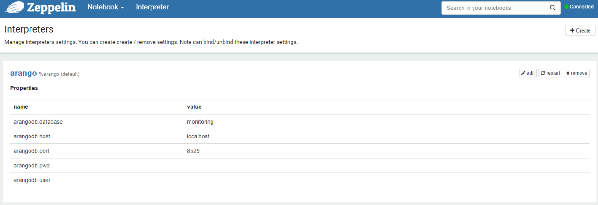
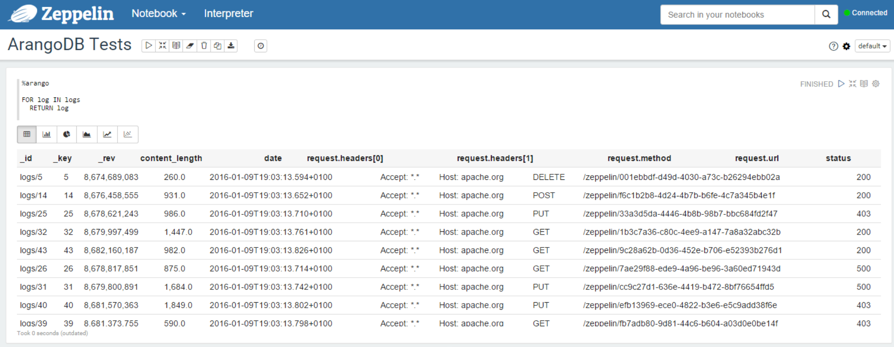
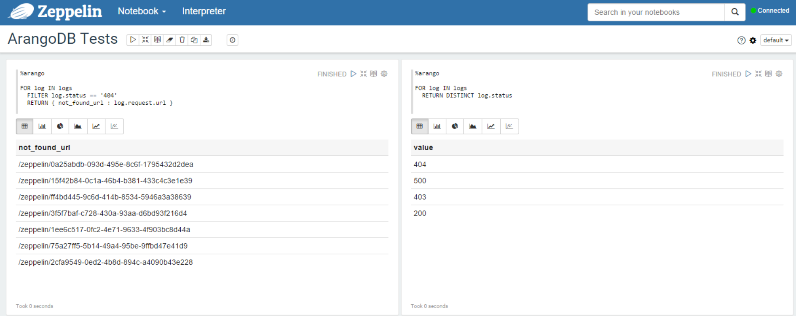

# [ArangoDB](https://www.arangodb.com/) Interpreter for [Appache Zeppelin](https://zeppelin.incubator.apache.org/)

This article is a contribution from our community member [bbonnin](https://github.com/bbonnin) and will show you how to set up the zeppelin integration for ArangoDB step by step with many examples and hints. 

What is Apache Zeppelin? This project aims to provide a web environment for easing data discovery, analytics and visualization. This is the GUI you should have in your company for processing and collaborate on your (big) data. It provides interpreters to interact with databases (Cassandra, PostgreSQL and other JDBC compliant database, …), to define processing of your data with Spark or Flink, etc. 

The ArangoDB interpreter for Apache Zeppelin aims to provide a new interpreter to query an ArangoDB. This interpreter only supports AQL ([ArangoDB Query Language](https://docs.arangodb.com/Aql/)).

> **Important** : the graph part of ArangoDB is **PARTIALLY** supported at the moment. If you want to test you can use the data from the [Actors and Movies Database example](https://docs.arangodb.com/cookbook/GraphExampleActorsAndMovies.html). 


## Flattened documents
Basically, in Zeppelin, you have notebooks in which you can type commands, that are interpreted and the results are displayed. Depending on your result format, you can have access to charts for displaying your data.

To have access to these charts, your output data format must be a table. But with ArangoDB the result of a query can contain a list of JSON documents which has a hierarchical structure (not flat as a row in a SQL table). 

So, to ease the integration in Zeppelin, the ArangoDB interpreter will flatten the results of the queries.

Suppose we have a JSON document:

```
{
  "date": "2015-12-08T21:03:13.588Z",
  "request": {
    "method": "GET",
    "url": "/zeppelin/4cd001cd-c517-4fa9-b8e5-a06b8f4056c4",
    "headers": [ "Accept: *.*", "Host: apache.org"]
  },
  "status": "403",
  "content_length": 1234
}
```

The data will be flattened like this:


content_length | date | request.headers[0] | request.headers[1] | request.method | request.url | status
---------------|------|--------------------|--------------------|----------------|-------------|-------
1234 | 2015-12-08T21:03:13.588Z | Accept: \*.\* | Host: apache.org | GET | /zeppelin/4cd001cd-c517-4fa9-b8e5-a06b8f4056c4 | 403


## How to use the interpreter

### Configuration

First, you have to configure the interpreter by setting the values of:
* the host and port of your ArangoDB server
* the user/password
* the database name




### Commands

In a paragraph, use `%arango` to select the ArangoDB interpreter and then input all commands.

> **Important**: 

### Examples :

* Document database :

```
| %arango
|
| FOR log in logs
|   RETURN log
|
```

  * The display as the table :




  * The display as a pie :


* Graph database :

```
| %arango
|
| FOR x IN actsIn COLLECT movie = x._to
|   WITH COUNT INTO counter
|   RETURN {movie: movie, nb_actors: counter}
|
```

<table>
  <tr><th>nb_actors</th><th>movie</th></tr>
  <tr><td>11.0</td><td>movies/AFewGoodMen</td></tr>
  <tr><td>4.0</td><td>movies/AsGoodAsItGets</td></tr>
  <tr><td>9.0</td><td>movies/JerryMaguire</td></tr>
  <tr><td>3.0</td><td>movies/JoeVersustheVolcano</td></tr>
  <tr><td>6.0</td><td>movies/SleeplessInSeattle</td></tr>
  <tr><td>4.0</td><td>movies/SnowFallingonCedars</td></tr>
</table>


* Other examples :




This interpreter can be found on github : https://github.com/bbonnin/zeppelin-arangodb-interpreter
